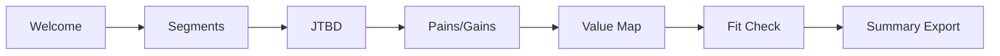

# ESG community platform design
_Exported on 6/30/2026 at 16:22:03 GMT+7 from Cursor (3.9.16)_

---

**User**

ช่วยออกแบบ website "ESG Community Platform"Act as a world-class Full-Stack Developer and UX/UI Designer. Build a highly interactive, โดยช่วยพัฒนา ต่อยอด ที่ทำเป็นไอเดีย ไว้เป็น HTML ,  ผมได้ส่งเป็น codeมาให้คุณ
--1.จุดประสงค์--- เพื่อสร้างชุมชน คนที่สนใจ ESG ตั้งแต่คนไม่มีความรู้เลย จนมีผู้เชี่ยวชาญที่ให้ทั้งความรู้ และเป็นที่แลกเปลี่ยน ทั้งความรุ้และะธุรกิจในรูปแบบต่างๆ
2.mood & tone --> sustanability felling,/emotional
3.มีทั้งภาษาไทยและอังกฤษ --cross comminucation
4.เป้าหมาย-- คนที่ต้องทำรายงาน"ESG Report และ บุคคลที่สนใจทั่วไป
5.ช่วงพัฒนาช่วงแรก การ sign in /Authขอเป็นแบบง่ายๆ --เพื่อทำกิจกรรมสะสมแต้มการ Engagementแล้วมาทำจริงๆที่หลัง
6.Act as an elite Full-Stack Web3/Tech Startup Developer and UI/UX Designer. Build a highly interactive, global ESG Community Platform named "Aetros" using React, Vite, Tailwind CSS, and a robust backend integration (Supabase/Firebase). 

The platform's core philosophy is "The Universe Begins Within You" — shifting the ESG narrative from corporate compliance to individual empowerment, utilizing global gamification and interactive community features.

1. BRAND SYSTEM & VISUAL DESIGN

- Theme: Futuristic, Cyber-Eco, Deep Tech Startup, Premium Dark Mode.

- Color Palette:

  - Primary Background: Deep Space Black (#0B0F19)

  - Text & Accents: Cosmic Smoke Gray (#E2E8F0) and Pure White (#FFFFFF)

  - Glow & CTA Neon: Aurora Neon Green (#00FF66)

- Typography: Clean, modern sans-serif (e.g., Inter or Space Grotesk) with futuristic layout elements.

- UI Components: Smooth micro-interactions, glassmorphism card styles, glowing borders on hover, dynamic entry animations (Framer Motion style), and floating interactive elements.

2. CORE FEATURES & PAGES TO BUILD

Page 1: Landing Page (The Gateway)

- Hero Section: Immersive dark background with an interactive glowing neon particle system or spinning 3D-like galaxy icon. Text: "Aetros: The Universe Begins Within You." Neon CTA button: "Launch Your Universe".

- Brand Story Section: Sleek scrolling presentation of the Aetros manifesto (Connecting Aether + Ethos into a global ESG community).

- Live Global Impact Counter: A beautiful, ticking real-time dashboard showing "Global Carbon Reduced", "Trees Planted", and "Active Innovators".

- Interactive Feature Bento Grid: Showing previews of the ecosystem (Community, Eco-Avatar, Carbon Tracker, Marketplace).

Page 2: User Dashboard & "Inner Universe" Eco-Avatar

- Personalized Dashboard: Greeting the user with their current "Impact Tier".

- Gamified Eco-Avatar: An interactive SVG/Canvas widget representing the user's "Inner Universe". The avatar expands, glows, and changes form (from a single particle to a glowing eco-galaxy) as the user logs ESG activities and gains XP.

- Dynamic Action Tracker: A fully functional form to log daily sustainable actions (e.g., commuting via EV, recycling, volunteering). Logging an action dynamically calculates and awards XP and Carbon Credits.

Page 3: Global Community & Crowdsourcing Hub

- Interactive Feed: Social feed where users and global organizations post green initiatives, ESG ideas, and tech proposals. Users can upvote (glowing neon effect), comment, and share.

- Challenge Hub: A grid of ongoing global sustainability challenges (e.g., "7-Day Zero Waste Challenge"). Includes a functional "Join Challenge" button, progress tracking bar, and leaderboard showing top global contributors.

Page 4: Green Marketplace & Impact Rewards

- Tokenized Rewards Store: Users can spend their earned Carbon Credits here.

- Product Cards: Futuristic grid featuring digital badges, tree-planting certificates, and sustainable tech partner discounts.

- Functional Checkout: Clicking "Redeem" opens a smooth checkout modal, checks user's token balance, and simulates a successful transaction with a receipt popup.

3. TECHNICAL & INTERACTIVE REQUIREMENTS

- State Management: Implement a global state to manage user authentication state, current user profile, total XP, Carbon Credits balance, and logged actions across all pages seamlessly.

- High Interactivity: Every button must have haptic-like hover effects (glow, slight scale up). Include smooth transitions between dashboard tabs or pages without full reloads.

- Responsive Design: Flawlessly optimized for Desktop, Tablet, and Mobile devices (using mobile-first Tailwind design).

- Data Persistence Mocking: Set up full mock data structures for profiles, feeds, and products so the prototype is immediately usable, interactive, and feels 100% production-ready.

Build the full-stack architecture with clean, scalable code structures, modular components, and comprehensive responsive layouts.

นี่คือ Brand Story และ Brand Colors Setup แบบจัดเต็ม เท่ ดุดัน และสร้างแรงบันดาลใจ สำหรับนำไปใช้บนหน้าเว็บไซต์ครับ

------------------------------

🌌 BRAND STORY: AETROS

(คำบรรยายแบรนด์สำหรับหน้า Website - แนะนำให้ใช้พื้นหลังสีดำ Space Black ตัวอักษรสีขาว/ควันบุหรี่ และเน้นจุดสำคัญด้วยสีเขียว Aurora นีออน)

[Headline / ส่วนหัว]

The Universe Begins Within You.

จักรวาลแห่งความยั่งยืน... เริ่มต้นที่ตัวคุณ

[Body Content / เนื้อหาหลัก]

เรามักถูกพร่ำบอกให้ช่วยกัน "รักษ์โลก" ราวกับว่าโลกเป็นสิ่งภายนอกที่แยกออกจากตัวเรา

แต่ในความเป็นจริง มนุษย์และธรรมชาติไม่ได้แยกจากกัน เราทุกคนต่างประกอบขึ้นจากธาตุสารและพลังงานเดียวกันกับดวงดาวในจักรวาล

Aetros เชื่อว่า พลังที่จะขับเคลื่อนสิ่งแวดล้อม สังคม และธรรมาภิบาล (ESG) ที่แท้จริง ไม่ได้เริ่มต้นจากข้อบังคับ กฎเกณฑ์ หรือตัวเลขในรายงาน... แต่มันระเบิดออกมาจาก "จักรวาลภายในตัวคุณ" (Your Inner Universe) จากความตระหนักรู้ ไอเดีย และทุกๆ การกระทำเล็กๆ ของมนุษย์แต่ละคน ที่พร้อมจะสร้างแรงกระเพื่อมอันยิ่งใหญ่

คำว่า Aetros ถือกำเนิดจากการผสานตัวตนของ Aether (สสารโบราณที่ถักทอห้วงอวกาศ) และ Ethos (เข็มทิศคุณธรรมและธรรมาภิบาล) เราไม่ใช่แค่แพลตฟอร์ม แต่เราคือ "เครือข่ายเทคโนโลยีแห่งอนาคต" ที่เชื่อมโยงผู้คน องค์กร และนวัตกรรมเข้าด้วยกัน เพื่อเปลี่ยนพลังงานจลน์ในตัวคุณ ให้กลายเป็นผลลัพธ์ที่จับต้องได้จริงบนโลกใบนี้

เมื่อคุณขยับ โลกจะเคลื่อนไหว

มาร่วมปลดปล่อยบิ๊กแบงแห่งความยั่งยืนไปด้วยกัน

[Call to Action / ปุ่มกด]

[ Launch Your Universe ➔ ] (เริ่มสร้างจักรวาลของคุณ)

------------------------------

🎨 BRAND COLORS: THE FUTURE OF ESG

ระบบสีที่คัดสรรมาเพื่อขับเคลื่อนภาพลักษณ์แบบ Deep Tech / Web3 Startup ที่ให้ความรู้สึกพรีเมียมและเปี่ยมด้วยพลังงาน

* Deep Space Black (#0B0F19)

* สัดส่วนที่ใช้: 60% (สีพื้นหลังหลัก)

   * อารมณ์: ความลึกลับ ความกว้างใหญ่ของจักรวาล ความมั่นคง และความน่าเชื่อถือระดับสูง

* Aurora Neon Green (#00FF66)

* สัดส่วนที่ใช้: 10% (สีเน้น - Accent Color สำหรับปุ่ม, ลิงก์สำคัญ, หรือขอบโลโก้)

   * อารมณ์: พลังงานที่ไม่มีวันหมด นวัตกรรมสีเขียว ความตื่นตัว และการเกิดใหม่

* Cosmic Smoke Gray (#E2E8F0)

* สัดส่วนที่ใช้: 30% (สีสำหรับตัวอักษรหลัก และกราฟิกเส้นไลน์มินิมอล)

   * อารมณ์: ความสะอาดตา ทันสมัย สไตล์สตาร์ทอัพระดับโลก อ่านง่ายบนพื้นหลังสีด

---

**Cursor**

กำลังสำรวจโค้ดและโครงสร้างโปรเจกต์ที่มีอยู่ เพื่อวางแผนพัฒนา Aetros ต่อจาก HTML ที่คุณส่งมา


พบว่า workspace มีแค่ wireframe CSS (ไม่สมบูรณ์) กับ spec ของ Aetros — ก่อนสรุปแผน ต้องยืนยันทิศทางแบรนด์และ backend ก่อน


**คำถามสำคัญก่อนวางแผน Aetros**

> **ทิศทาง Visual Design: Wireframe เดิมใช้โทน earthy + ฟอนต์ Fraunces/IBM Plex Sans Thai แต่ spec Aetros ใช้ Cyber-Eco (#0B0F19, #00FF66) + Space Grotesk/Inter — ต้องการให้ใช้ทิศทางไหน?**
> - Aetros Cyber-Eco เต็มรูปแบบ (ตาม spec ล่าสุด) + เก็บ IBM Plex Sans Thai สำหรับภาษาไทย ✔
> - ผสมทั้งสอง: โครง layout จาก wireframe + สี/เอฟเฟกต์ neon จาก Aetros
> - คง wireframe เดิมเป็นหลัก แล้วค่อยๆ ปรับเป็น Aetros ทีหลัง

> **Backend สำหรับ Phase 1 (MVP mock auth + data persistence): ต้องการใช้ตัวไหน?**
> - Mock ทั้งหมดใน localStorage/Zustand ก่อน — ยังไม่ต่อ backend จริง (เร็วที่สุด)
> - Supabase (Auth + PostgreSQL) — เตรียมพร้อม scale ตั้งแต่แรก
> - Firebase (Auth + Firestore) — เตรียมพร้อม scale ตั้งแต่แรก
>
> Answer: B แต่การlog in /Auth  ให้เป็นแบบง่ายๆเข้าได้เลย ทำจรงๆทีหลัง แต่ มี  ให้ มีสิทธิ์การอนุมัติถ้าต้องมี

ได้ทิศทางชัดแล้ว — จะวางแผน Aetros แบบ Cyber-Eco เต็มรูปแบบ พร้อม Supabase และ auth แบบง่ายสำหรับ MVP


---

**User**

Implement the plan as specified, it is attached for your reference. Do NOT edit the plan file itself.

To-do's from the plan have already been created. Do not create them again. Mark them as in_progress as you work, starting with the first one. Don't stop until you have completed all the to-dos.

---

**Cursor**

เริ่มดำเนินการตามแผน — เริ่มจาก scaffold โปรเจกต์ก่อน


กำลังตั้งค่า config และสร้างโครงสร้างไฟล์หลักทั้งหมด


Build สำเร็จแล้ว — กำลังอัปเดต todos และตรวจสอบ dev server


**Aetros ESG Community Platform** พร้อมใช้งานแล้ว โปรเจกต์อยู่ที่ [`aetros/`](aetros/)

## เริ่มใช้งาน

```bash
cd "c:\Users\User\Desktop\ESG Community Platform\aetros"
npm run dev
```

เปิดที่ **http://localhost:5173/** (dev server รันอยู่แล้ว)

---

## สิ่งที่สร้างครบตามแผน

### Tech Stack
- React + Vite + TypeScript + Tailwind CSS v4
- Framer Motion, Zustand, react-i18next, React Router
- Supabase client + migration schema (mock fallback ใน Phase 1)

### 4 หน้าหลัก
| หน้า | Route | ฟีเจอร์ |
|------|-------|---------|
| **Landing** | `/` | Particle hero, Brand Story, Live Impact Counters, Bento Grid |
| **Dashboard** | `/dashboard` | Eco-Avatar 4 tiers, Action Tracker → XP + Carbon Credits |
| **Community** | `/community` | Feed, upvote, Knowledge Hub filter, Challenges, Leaderboard |
| **Marketplace** | `/marketplace` | Redeem flow + checkout modal + receipt |

### Auth & Roles (MVP)
- Login ง่าย — ไม่ต้องใช้รหัสผ่าน
- Demo personas: Member / Expert / Moderator / Admin
- Expert โพสต์ → status `pending` → Moderator อนุมัติ/ปฏิเสธ

### i18n
- สลับ **TH / EN** ได้จาก header
- Brand story ครบทั้งสองภาษา

### Design System
- Aetros Cyber-Eco: `#0B0F19`, `#00FF66`, `#E2E8F0`
- Space Grotesk + IBM Plex Sans Thai
- Glassmorphism, neon glow, page transitions

---

## ทดสอบ Flow แนะนำ

1. กด **Launch Your Universe** → Login เป็น **Moderator**
2. ไป **Dashboard** → บันทึกกิจกรรม → ดู Eco-Avatar และ XP เปลี่ยน
3. Login เป็น **Expert** → สร้างโพสต์ → กลับเป็น Moderator → อนุมัติ
4. ไป **Marketplace** → แลก Carbon Credits

---

## Supabase (Phase 2)

เมื่อพร้อมต่อ backend จริง:
1. Copy `.env.example` → `.env` แล้วใส่ credentials
2. รัน migration ที่ [`aetros/supabase/migrations/001_initial.sql`](aetros/supabase/migrations/001_initial.sql)
3. ตั้ง `VITE_USE_SUPABASE=true`

---

**User**


# Dashboard Deep-Dive Revamp — "Inner Universe"

Transform `/dashboard` into a live, cinematic, real-time experience while keeping the existing Supabase wiring (profiles, actions_log, log_action RPC) intact.

## 1. Personalized Greeting & Impact Tier

Rebuild the header card in `src/routes/_authenticated/dashboard.tsx`:
- Greeting: "Welcome back, Cosmic Innovator {display_name}" (TH: "ยินดีต้อนรับกลับ นักสร้างจักรวาล {ชื่อ}").
- New tier system in `src/components/EcoAvatar.tsx` (`tierFor`) aligned to the brief:
  - Tier 1 Nebula Novice (0–499 XP)
  - Tier 2 Stellar Shaper (500–1499 XP)
  - Tier 3 Galactic Guardian (1500+ XP)
- Glowing tier badge: pill with Aurora Neon Green (#00FF66) gradient ring, animated pulse-glow, tier icon.
- XP progress bar: gradient fill (neon green → aqua), shimmer sweep animation, labels "{xp} / {nextTier} XP" plus "{remaining} XP to {nextTierName}".

## 2. Eco-Avatar — Three Evolution Stages

Rewrite `EcoAvatar.tsx` as a Canvas-driven widget (requestAnimationFrame) with three distinct visuals chosen by tier:
- **Novice (0–499):** single neon particle orbiting a dark core, soft pulse-glow halo, faint dust.
- **Shaper (500–1499):** 3-layer constellation — concentric orbit rings, 8–12 glowing dots rotating at different speeds, connecting lines that twinkle.
- **Guardian (1500+):** spiral Eco-Galaxy — ~400 particles in 2 logarithmic spiral arms, hues interpolated between neon green (#00FF66) and aqua (#00E5FF), slow rotation, central bright core with glow falloff.

Behaviour:
- Smooth crossfade between stages when XP threshold crosses (200ms fade out → swap stage → fade in).
- "Simulate Level Up" button beside the avatar: local-only XP boost (+250) for preview; calls a `simulateXp` local state overlay that adds to the rendered XP without writing to DB. Reset button returns to true profile XP.
- Reduced-motion respected via `prefers-reduced-motion`.

## 3. Dynamic Action Tracker

Replace current 8-dropdown list with the 8 brief-specified actions and new XP/credit values:
- EV / Public Transport — +50 XP, +10 CC
- Recycling / Zero Plastic — +30 XP, +5 CC
- Tree Planting / Volunteering — +100 XP, +20 CC
- Energy Saving — +20 XP, +3 CC
-
.


Each card: glass tile, large emoji + lucide icon, hover lift, neon border glow on hover.

On click → `log_action` RPC (unchanged). On success:
- New `ParticleBurst` component: spawns 24 neon particles from click position (tracked via event), animated with rAF, fade out ~900ms.
- Floating "+50 XP" / "+10 CC" text rises and fades (Framer-less, pure CSS keyframes).
- Optimistic update of profile cache so Eco-Avatar + counters react instantly.
- Toast retained as fallback.

## 4. Recent Activity & Stat Counters

- Two large stat cards above/beside avatar: "Total Carbon Credits" and "Total XP Earned" using existing `ImpactCounter` (already animates running numbers); add gradient text + glass card.
- "Recent Cosmic Actions" list:
  - Prepend new entries with `animate-fade-in` (slide + opacity) using a keyed list.
  - Show icon, localized label, relative time ("2m ago" / "2 นาทีที่แล้ว"), XP and CC chips.
  - Realtime: subscribe to `actions_log` via Supabase channel filtered by `user_id` (inside `useEffect`, cleaned up on unmount) so logs from other tabs/devices appear live. Requires enabling realtime on `actions_log`.

## 5. Visual System

- Background: subtle animated star-field layer behind main content (canvas, very low opacity) for the Deep Space feel.
- Cards: existing `.glass` + `glow-border`, add new `.glow-aurora` utility for the tier badge.
- New keyframes in `src/styles.css`: `shimmer`, `float-y` (already exists), `particle-rise`, `tier-glow`.
- All copy bilingual via `useI18n` — new keys added to `src/lib/i18n.tsx`.

## Technical Notes

- Files touched:
  - `src/routes/_authenticated/dashboard.tsx` (rewrite layout + handlers)
  - `src/components/EcoAvatar.tsx` (canvas rewrite + new tiers)
  - `src/components/ParticleBurst.tsx` (new)
  - `src/components/FloatingXp.tsx` (new)
  - `src/components/TierBadge.tsx` (new)
  - `src/components/Starfield.tsx` (new, lightweight canvas)
  - `src/lib/i18n.tsx` (add keys)
  - `src/styles.css` (new keyframes/utilities)
- Backend:
  - One migration: `ALTER PUBLICATION supabase_realtime ADD TABLE public.actions_log;` and `ALTER TABLE public.actions_log REPLICA IDENTITY FULL;` to enable realtime row payloads. No schema/RLS changes.
- State: React Query cache stays the source of truth; optimistic update in `log_action` mutation + realtime channel invalidates as backup.
- Performance: single rAF loop per canvas, paused when tab hidden (`visibilitychange`), capped DPR at 2.

## Out of Scope

- No changes to Community, Marketplace, Auth, or DB schema beyond enabling realtime.
- Tier thresholds in marketplace/reward rules untouched (only avatar/tier UI uses new thresholds).


---

**Cursor**

กำลังสำรวจโครงสร้างโปรเจกต์ปัจจุบัน เพื่อปรับ Dashboard ตามสเปกที่ให้มา


กำลังปรับ Dashboard ตามสเปก — เริ่มจาก tier system, คอมโพเนนต์ใหม่ และ API layer


Dashboard **Inner Universe** ปรับใหม่ครบตามสเปกแล้ว โดย map กับโครงสร้างโปรเจกต์ปัจจุบัน (`DashboardPage.tsx`, Zustand, Supabase mock/RPC)

## สิ่งที่เปลี่ยน

### 1. Header + Tier System
- คำทักทาย: *"Welcome back, Cosmic Innovator {name}"* / *"ยินดีต้อนรับกลับ นักสร้างจักรวาล {name}"*
- Tier ใหม่ใน [`src/lib/tiers.ts`](aetros/src/lib/tiers.ts):
  - **Nebula Novice** (0–499 XP)
  - **Stellar Shaper** (500–1499 XP)
  - **Galactic Guardian** (1500+ XP)
- [`TierBadge`](aetros/src/components/dashboard/TierBadge.tsx) — pill + glow pulse
- XP progress bar — gradient neon→aqua + shimmer animation

### 2. Eco-Avatar (Canvas)
[`EcoAvatar.tsx`](aetros/src/components/dashboard/EcoAvatar.tsx) — rAF canvas 3 stages:
- **Novice:** particle โคจรรอบ core + halo
- **Shaper:** 3 orbit rings + 10 dots + twinkling lines
- **Guardian:** ~400 spiral particles (green→aqua)
- Crossfade 200ms เมื่อข้าม tier
- **Simulate Level Up** (+250 XP preview) + **Reset Preview**
- รองรับ `prefers-reduced-motion`

### 3. Dynamic Action Tracker
8 action cards พร้อม XP/CC ใหม่:
| Action | XP | CC |
|--------|----|----|
| EV / Public Transport | 50 | 10 |
| Recycling / Zero Plastic | 30 | 5 |
| Tree Planting / Volunteering | 100 | 20 |
| Energy Saving | 20 | 3 |
| + 4 อื่น (water, plant-based, zero waste, green commute) |

- Glass tiles + emoji + Lucide icon + hover lift/glow
- [`ParticleBurst`](aetros/src/components/dashboard/ParticleBurst.tsx) — 24 particles จากจุดคลิก
- [`FloatingXp`](aetros/src/components/dashboard/FloatingXp.tsx) — "+XP / +CC" ลอยขึ้น (CSS keyframes)
- Optimistic update ผ่าน Zustand

### 4. Stats + Recent Activity
- Stat cards: **Total XP** + **Total Carbon Credits** (AnimatedCounter + gradient text)
- **Recent Cosmic Actions** — fade-in, relative time (TH/EN), XP/CC chips
- Realtime subscription ผ่าน [`dashboardApi.ts`](aetros/src/lib/dashboardApi.ts) เมื่อเปิด Supabase

### 5. Visual System
- [`Starfield`](aetros/src/components/dashboard/Starfield.tsx) — canvas background
- Keyframes ใน [`index.css`](aetros/src/index.css): `shimmer`, `particle-rise`, `tier-glow`, `fade-in`

### 6. Backend
- Migration [`002_dashboard_realtime.sql`](aetros/supabase/migrations/002_dashboard_realtime.sql):
  - Realtime บน `action_logs`
  - `log_action` RPC (อัปเดต profile + insert log)

---

## ทดสอบ

```bash
cd aetros
npm run dev
```

1. Login → ไป `/dashboard`
2. แตะ action card → ดู particle burst + floating XP
3. กด **Simulate Level Up** → ดู avatar เปลี่ยน stage
4. Login เป็น **Moderator** ไม่กระทบ — Community/Marketplace ไม่เปลี่ยน

เมื่อพร้อมต่อ Supabase จริง: รัน migration 002 แล้วตั้ง `VITE_USE_SUPABASE=true` ใน `.env`

---

**User**

cd aetros
npm run dev

---

**Cursor**

Dev server เดิมมี error เรื่อง `tslib` — กำลังรันใหม่


Dev server รันแล้ว

- **URL:** http://localhost:5174/  
  (พอร์ต 5173 ถูกใช้อยู่จาก session ก่อนหน้า เลยเปิดที่ 5174)

เปิดลิงก์ในเบราว์เซอร์ได้เลย หรือไปที่ `/dashboard` หลัง login เพื่อดู Inner Universe revamp

---

**User**

You are a product strategist and UX designer who specializes in:

- Jobs-to-Be-Done (JTBD)---->JOBS-TO-BE-DONE.txt

- Value Proposition Canvas (VPC)

- Product-Market Fit

- Business Model Canvas (BMC)

 

Your task:

สร้างเว็บแอปแบบ interactive (single-page หรือ multi-step wizard ก็ได้) เพื่อช่วยผู้ใช้ “ตกผลึก” โมเดลธุรกิจและ Value Proposition สำหรับ Aetros — ESG Community Platform--แพลตฟอร์มชุมชน ESG ระดับโลก ที่เชื่อมโยงผู้คน องค์กร และนวัตกรรม — จากผู้เริ่มต้นจนผู้เชี่ยวชาญ โดยใช้ Jobs-to-be-Done เป็นแกนกลาง แล้วแตกไปสู่:

 

- Customer Segments

- Customer Jobs, Pains, Gains

- Value Proposition (Products/Services, Pain Relievers, Gain Creators)

- Product–Solution Fit / Product–Market Fit (ระดับเบื้องต้น)

- Business Model Canvas ฉบับ 1 หน้า

 

1. เป้าหมายเว็บ

 

ออกแบบเว็บให้ใช้งานเป็น “interactive workshop” ส่วนตัวของผู้ใช้:

- ให้ผู้ใช้ตอบคำถามทีละ step

- มีตัวอย่าง (examples) และ hint ที่อิงแนวคิด JTBD และ VPC จริง

- สรุปผลเป็นตาราง/บัตรสรุป (summary cards) ที่สามารถ:

  - copy ไปแปะใน Obsidian ได้

  - export หรือคัดลอกไปใช้ต่อใน Excel / Google Sheets ได้

[web:4][web:6][web:11][web:8]

 

2. เฟรมเวิร์กหลักที่ต้องใช้

 

อ้างอิง framework เหล่านี้อย่างชัดเจนแต่ไม่ทฤษฎีจ๋า:

- Jobs-to-Be-Done: เน้น “ลูกค้าจ้างผลิตภัณฑ์ไปทำงานอะไร” แยกเป็น functional, emotional, social [web:12][web:9].

- Value Proposition Canvas: Customer Profile (Jobs, Pains, Gains) + Value Map (Products & Services, Pain Relievers, Gain Creators) [web:4][web:11].

- Product–Market Fit: แบ่งระดับ Fit อย่างน้อย 3 ชั้น เช่น Problem–Solution Fit, Product–Market Fit, Business Model Fit ตามแนวทางสมัยใหม่ [web:6][web:8].

- Business Model Canvas: ช่อง Customer Segments, Value Proposition, Channels, Revenue, Key Activities, Key Resources, Partners, Cost Structure แต่ให้จัดเรียงและอธิบายแบบ JTBD-first [web:10][web:13].

 

3. โฟกัส Domain: “เครื่องประดับสายมู”

 

ใช้โจทย์ธุรกิจนี้เป็นตัวอย่างหลักตลอดทั้งเว็บ:

- Spiritual / belief jewelry ที่ลูกค้าใส่เพื่อ:

  - ความมั่นใจ

  - การปกป้อง

  - เป้าหมายชีวิต (งาน, เงิน, ความรัก ฯลฯ)

- ลูกค้าหลัก: Young professionals, Aesthetic spiritual seekers, Gift buyers (สามารถปรับ / เพิ่ม segment ได้)

- ใช้ภาษาที่อ่านง่าย แต่มีกลิ่นอาย modern business / product thinking

 

อย่าลงรายละเอียดความเชื่อหรือพิธีกรรมมากเกินไป ให้โฟกัสธุรกิจ แบรนด์ และ JTBD เป็นหลัก

 

4. โครงสร้าง UX แบบขั้นตอน (Step-by-step Flow)

 

ออกแบบเว็บให้แบ่งเป็น 5–7 ขั้นตอนหลัก ๆ ดังนี้:

 

1) Welcome & Context

   - อธิบายสั้น ๆ ว่าหน้านี้ช่วยอะไร

   - อธิบายคีย์เวิร์ด 3 คำ: JTBD, Value Proposition, Product–Market Fit แบบเข้าใจง่ายใน 2–3 ประโยค

   - ให้ user ตั้งชื่อโปรเจกต์/แบรนด์ของตัวเอง (เช่น “Spiritual Minimalist Jewelry for Young Professionals”)

 

2) Customer Segments & Situations

   - ให้ผู้ใช้กรอก/เลือก segment (เช่น Young Professional, Aesthetic Seeker, Gift Buyer)

   - ถามถึง “สถานการณ์” หรือ context ที่ลูกค้าจะใช้สินค้า

     เช่น “ก่อนเริ่มงานใหม่”, “กำลังรู้สึกไม่มั่นใจ”, “ตอนซื้อของขวัญให้เพื่อน”

   - สรุปเป็น “Who + When + Where” สำหรับแต่ละ segment

 

3) Jobs-to-Be-Done

   - ให้กรอก core job ในรูปแบบ JTBD statement: 

     “When [situation], I want to [job], so I can [desired outcome]” [web:9][web:12].

   - แยกให้ user ระบุ:

     - Functional jobs

     - Emotional jobs

     - Social jobs

   - มีตัวอย่างสำหรับเครื่องประดับสายมู 2–3 ตัวอย่างให้ user ดูเป็น guideline

 

4) Pains & Gains

   - แยกส่วนกรอก:

     - Pains: ความกลัว, อุปสรรค, frustration เมื่อพยายามทำ job นั้น [web:11].

     - Gains: ผลลัพธ์ดี ๆ ที่อยากได้ ทั้ง functional, emotional, social [web:4][web:6].

   - ให้ user ให้คะแนนความสำคัญของแต่ละ pain/gain (เช่น 1–5) เพื่อช่วยจัดลำดับ priority

 

5) Value Proposition / Value Map

   - ให้ user กรอก:

     - Products & Services: ประเภทสินค้า/บริการของแบรนด์

     - Pain Relievers: สินค้าหรือฟีเจอร์ใดช่วยลด Pains

     - Gain Creators: สินค้าหรือฟีเจอร์ใดสร้าง Gains

   - มีตัวอย่างที่ผูกกับ spiritual jewelry เช่น:

     - Story card / ritual card

     - Minimal design for everyday wear

     - Gift-ready packaging

 

6) Product–Solution Fit / Product–Market Fit Check

   - สร้าง mini “fit check”:

     - Mapping Pains ↔ Pain Relievers

     - Mapping Gains ↔ Gain Creators [web:6][web:11].

   - ให้ user ให้คะแนนว่าแต่ละ Pain / Gain ถูกตอบโดย Value Map ดีแค่ไหน (Low / Medium / High)

   - สร้างข้อความ feedback อัตโนมัติ เช่น:

     - “คุณยังไม่มี Pain Reliever สำหรับ pain X”

     - “Gain Y สำคัญมาก แต่ไม่มี feature ที่ตอบชัดเจน”

 

7) BMC Summary

   - ใช้ข้อมูลจากทุก step มาประมวลเป็น “BMC 1 หน้า” ในรูปแบบ:

     - ตาราง 9 ช่อง

     - หรือ bullet-based BMC ที่สามารถ copy เป็น Markdown / CSV ได้

   - ระบุชัดว่าช่อง Customer Segments และ Value Proposition ผูกกับ JTBD–Pains–Gains ที่ได้จาก step ก่อนหน้า [web:4][web:6][web:11].

 

5. รูปแบบ Output

 

ออกแบบ output อย่างน้อย 3 รูปแบบ:

 

1) Markdown (เหมาะกับ Obsidian)

   - แสดง BMC 1 หน้า

   - แสดง Value Proposition Canvas (Customer Profile + Value Map)

   - แสดง JTBD Statements แยกตาม Segment

 

2) Table / CSV-friendly

   - ตารางที่มีคอลัมน์ เช่น: Segment, JTBD, Pain, Gain, Product/Feature, Pain Reliever, Gain Creator, Channel, Price Tier

 

3) Short Insight Text

   - สรุปเป็นย่อหน้า 3–5 บรรทัด บอก insight หลัก เช่น:

     - “Segment หลักของคุณคือ …”

     - “Job สำคัญสุดคือ …”

     - “ช่องว่างหลักใน Value Proposition คือ …”

 

6. Requirements ด้านการออกแบบและโค้ด

 

- ใช้ภาษา UI หลักเป็นภาษาไทย (แต่เขียนโค้ดและ comment เป็นอังกฤษได้)

- ใช้คำอธิบายที่เป็นมิตร อ่านง่าย ไม่ jargon เกินไป

- โครงสร้างโค้ดควรแยก:

  - ขั้นตอน (steps)

  - state (object สำหรับเก็บข้อมูล JTBD / VPC / BMC)

  - ฟังก์ชันสำหรับ generate summary (Markdown / table text)

- ให้ความสำคัญกับการ “ช่วยคิด” ไม่ใช่แค่ “ให้กรอกช่องว่าง”

  - มี tips / example / checklist เล็ก ๆ ในแต่ละ step

- เตรียมโครงสร้างให้ต่อยอดได้ภายหลัง เช่น:

  - เพิ่ม feature export

  - เพิ่ม template สำหรับธุรกิจอื่น

 

7. First Deliverable

 

ใน response แรกของคุณ:

1) อธิบาย flow ของเว็บแบบ high-level (user journey)

2) เสนอ structure ของ data model (เช่น JTBDObject, SegmentObject ฯลฯ)

3) เสนอ wireframe คร่าว ๆ ของแต่ละ step (เป็น text หรือ pseudo-UI)

4) จากนั้นค่อยเริ่มลงโค้ด UI (เช่น React / Vue / Svelte หรือ stack ที่เหมาะกับ Lovable) โดยให้โค้ดสามารถรันได้ตั้งแต่เป็น prototype

 

Focus on clarity, interactivity, and using JTBD as the backbone to tie BMC and Value Proposition together.

-- ออกแบบ เพิ่ม module ให้กลมกลืนกับของเดิม  ถ้าอันไหนซ้ำซ้อนก็ช่วยจัดเรียงให้เข้าท่าระดับสากล หรือ ปรับลด เพิ่มให้ไดเลย เพื่อให้กลมกลืนกับของเดิม  

---

**Cursor**

กำลังสำรวจโปรเจกต์และไฟล์ JTBD ที่มีอยู่ เพื่อออกแบบ workshop module ให้กลมกลืนกับ Aetros


กำลังสร้างโมดูล Strategy Workshop (JTBD → VPC → BMC) สำหรับ Aetros โดยใช้ตัวอย่างจากโดเมน ESG แทนเครื่องประดับสายมู


**Strategy Lab** — โมดูล JTBD → VPC → BMC workshop ถูกเพิ่มเข้า Aetros แล้ว โดยปรับโดเมนเป็น **ESG Community Platform** (ไม่ใช่เครื่องประดับสายมู) ให้สอดคล้องกับแพลตฟอร์มและ [`JOBS-TO-BE-DONE.txt`](JOBS-TO-BE-DONE.txt)

---

## User Journey (7 Steps)



| Step | เนื้อหา |
|------|--------|
| 1 | คำอธิบาย JTBD / VPC / PMF + ตั้งชื่อโปรเจกต์ + โหลด template Aetros |
| 2 | Customer Segments — Who / When / Where / Situation |
| 3 | JTBD statements + Functional / Emotional / Social jobs |
| 4 | Pains & Gains พร้อมคะแนนความสำคัญ 1–5 |
| 5 | Products & Services, Pain Relievers, Gain Creators |
| 6 | Fit Check (Low/Med/High) + auto feedback |
| 7 | Export — Insight / Markdown / CSV / BMC 9 ช่อง + Copy |

---

## Data Model

```typescript
WorkshopState {
  projectName, currentStep
  segments: Segment[]           // Who, When, Where, Situation
  jtbdStatements: JTBDStatement[]
  pains / gains: RankedItem[]   // importance 1-5, dimension
  valueMap: { productsServices, painRelievers, gainCreators }
  fitScores: FitScore[]
  bmc: BMCFields                // 9 blocks
}
```

ไฟล์หลัก: [`src/workshop/types.ts`](aetros/src/workshop/types.ts), [`useWorkshopStore.ts`](aetros/src/workshop/useWorkshopStore.ts), [`exportSummary.ts`](aetros/src/workshop/exportSummary.ts)

---

## วิธีใช้งาน

```bash
cd aetros
npm run dev
```

เปิด **http://localhost:5174/workshop** (หรือพอร์ตที่ dev server แสดง)

- Nav: **Strategy Lab** ใน header (public — ไม่ต้อง login)
- Landing: การ์ด **Strategy Lab** ใน Bento Grid
- กด **โหลดตัวอย่าง Aetros (ESG)** ใน Step 1 เพื่อดู template สำเร็จรูป

---

## Output 3 รูปแบบ

1. **Markdown** — Obsidian-ready (JTBD + VPC + BMC table)
2. **CSV** — นำเข้า Google Sheets
3. **Insight Text** — สรุป 3–5 บรรทัด (segment, job, gap)

ข้อมูลเก็บใน `localStorage` (`aetros-workshop`)

---

## การผสานกับ Aetros เดิม

| เดิม | Workshop |
|------|----------|
| Knowledge Hub (Community) | เนื้อหา ESG สำหรับลูกค้า |
| **Strategy Lab** | เครื่องมือสำหรับ founder/product team ออกแบบโมเดล |
| Dashboard gamification | ตัวอย่าง Gain Creators ใน template |

Template Aetros อ้างอิงฟีเจอร์จริง: Community Hub, Eco-Avatar, Marketplace, Expert moderation

---

## ตัวอย่าง JTBD (Aetros ESG)

> When ใกล้ deadline ESG Report, I want to หา framework และ best practice ที่ใช้ได้จริง, so I can ส่งรายงานได้โดยไม่เริ่มจากศูนย์

สอดคล้องหลักการจาก JOBS-TO-BE-DONE.txt: *ลูกค้าซื้อความก้าวหน้า (Progress) ไม่ใช่แค่แพลตฟอร์ม*

---

**User**

ดุประวัติที่แชทก่อนหน้านี้อย่างไร กดไปที่  show cchat history ทำไมมีแต่หน้านี้

---

**Cursor**

กำลังตรวจสอบเอกสาร Cursor เรื่องประวัติแชท เพื่ออธิบายให้ตรงกับที่คุณเห็น


**Show chat history** ใน Cursor มักแสดง **รายการบทสนทนา (chat threads)** ไม่ใช่ข้อความทุกข้อความในหน้าเดียว — ถ้ามีแค่ thread เดียว ก็จะเห็นแค่ “หน้านี้” ครับ

## ทำไมกดแล้วเห็นแค่หน้านี้

1. **แต่ละแชท = 1 thread แยกกัน**  
   ถ้าเปิดแชทใหม่ (New Chat / Agent ใหม่) งานเก่าจะอยู่คนละ thread ไม่รวมในหน้าปัจจุบัน

2. **Show chat history = รายการ thread**  
   ไม่ใช่ log ทุก session ตั้งแต่เริ่มโปรเจกต์ — ถ้าเคยใช้แค่ thread เดียว รายการก็มีแค่ 1 รายการ

3. **งาน Aetros ก่อนหน้านี้** (สร้างแอป, Dashboard revamp, Strategy Lab) น่าจะอยู่ **ใน thread นี้** ถ้ายังไม่เคยกด New Chat ระหว่างทาง

4. **Plan mode vs Agent mode** อาจเป็นคนละ session — บางครั้งประวัติไม่รวมกันในรายการเดียว

---

## วิธีดูประวัติแชท

| วิธี | ทำอย่างไร |
|------|-----------|
| **Chat history ใน sidebar** | เปิด panel แชท → ไอคอนประวัติ / รายการแชทเก่า → เลือก thread อื่น (ถ้ามี) |
| **เลื่อนขึ้นใน thread ปัจจุบัน** | ในแชทนี้ เลื่อนขึ้นไปด้านบน — ข้อความเก่าอยู่ใน thread เดียวกัน |
| **Composer history** | ถ้าเคยใช้ Composer แยกจาก Chat ประวัติอาจอยู่ใน Composer ไม่ใช่ Agent Chat |
| **แชทใหม่ vs แชทเดิม** | กด New Chat แล้ว history จะมีหลายรายการ — แต่ละรายการ = 1 บทสนทนา |

---

## สรุปสั้นๆ

- เห็นแค่หน้านี้ = **มีแค่ 1 thread** หรือกำลังดู **thread ปัจจุบัน**  
- งานก่อนหน้าใน **thread เดียวกัน** → **เลื่อนขึ้น** ในแชทนี้  
- งานอยู่ **thread อื่น** → เปิดจาก **Chat history** แล้วเลือกรายการอื่น (ถ้ามี)

---

## ถ้าหา thread เก่าไม่เจอ

- อาจถูกลบ / sync ไม่ครบ / เปิด workspace คนละโฟลเดอร์  
- โค้ดที่ทำไว้ยังอยู่ที่ [`aetros/`](aetros/) แม้แชทเก่าหาย

ถ้าบอกได้ว่าใช้ **Chat**, **Composer** หรือ **Agent** และกด New Chat ไปกี่ครั้ง จะช่วยไล่ได้ละเอียดขึ้นครับ

---

**User**

จะเก็บ ไว้ในนี้เพื่อศึกษาทำอย่างไร หรือdownloadทำอย่างไร
2.ถ้าขึ้นthread  ใหม่ ของเดิมเก็บไว้ที่ไหน --ที่ Show chat historyหรือป่าว จะได้ไม่ต้อง ออก

---

**Cursor**

## 1. เก็บแชทไว้ศึกษา / Download ทำอย่างไร

Cursor **ยังไม่มีปุ่ม “Export chat เป็น PDF/Word”** แบบสมบูรณ์ในทุกเวอร์ชัน แต่ทำได้แบบนี้:

### วิธีที่ใช้บ่อย (แนะนำ)

| วิธี | ทำอย่างไร |
|------|-----------|
| **Copy ทั้งแชท** | ใน panel แชท → คลิก `...` (เมนู) → **Copy chat** / **Export** (ถ้ามี) → วางใน Notion / Obsidian / Word |
| **Copy ทีละส่วน** | เลือกข้อความที่อยากเก็บ → Ctrl+C → วางในไฟล์ `.md` ในโปรเจกต์ เช่น `docs/chat-notes.md` |
| **เก็บ Plan** | แผนที่สร้างไว้ (เช่น Aetros plan) อยู่ที่ `.cursor/plans/` — เปิดอ่าน/คัดลอกได้โดยไม่ต้องพึ่งแชท |
| **เก็บโค้ดจริง** | สิ่งที่ทำแล้วอยู่ใน [`aetros/`](aetros/) — นี่คือผลลัพธ์ถาวรที่สำคัญที่สุด |

### ไฟล์ประวัติแชทบนเครื่อง (Agent)

Cursor เก็บ transcript บางส่วนไว้ในเครื่อง สำหรับโปรเจกต์นี้:

```
C:\Users\User\.cursor\projects\c-Users-User-Desktop-ESG-Community-Platform\agent-transcripts\
```

เป็นไฟล์ `.jsonl` (ข้อความดิบของ agent) — เปิดด้วย Notepad / VS Code ได้ แต่ **อ่านยากกว่าใน UI** เหมาะสำหรับ backup มากกว่าอ่านศึกษา

---

## 2. ขึ้น Thread ใหม่ — ของเดิมอยู่ที่ไหน?

**ใช่ — โดยทั่วไป thread เก่าอยู่ใน Show chat history** (หรือรายการแชทใน sidebar) ไม่หายทันทีเมื่อกด New Chat

```
Thread เก่า  →  เก็บใน Chat History  →  คลิกกลับมาเปิดได้
Thread ใหม่  →  เริ่มว่าง  →  ไม่มีข้อความเก่าใน thread นี้
```

### สิ่งที่ควรรู้

- **New Chat = บทสนทนาใหม่** — AI ใน thread ใหม่ **ไม่จำ** ข้อความใน thread เก่า (ยกเว้น rules / ไฟล์ในโปรเจกต์)
- **Thread เก่าไม่หาย** — อยู่ใน history จนกว่าจะลบหรือ sync/เคลียร์
- **ไม่ต้อง “ออก” จาก Cursor** — แค่สลับ thread จาก history กลับมาได้

### ถ้า history มีแค่ 1 รายการ

แปลว่าเคยใช้แค่ thread เดียว หรือ thread เก่าถูกลบ / เปิด workspace คนละโฟลเดอร์ — งานเก่าอาจอยู่ใน thread นี้ (เลื่อนขึ้นดู) หรือใน transcript บนเครื่อง

---

## แนวทางเก็บไว้ศึกษา (แนะนำ)

1. **Copy chat** วางใน Obsidian / Notion เป็นหัวข้อ “Aetros Development Log”
2. **เก็บ plan** จาก `.cursor/plans/` ไว้ในโฟลเดอร์ `docs/` ของโปรเจกต์
3. **อย่าพึงแชทอย่างเดียว** — โค้ดใน `aetros/` + git commit คือแหล่งความจำที่แม่นที่สุด
4. **ก่อน New Chat** — copy แชทสำคัญไว้ก่อน หรือจดว่า thread ไหนใน history

---

## สรุปสั้นๆ

| คำถาม | คำตอบ |
|--------|--------|
| Download แชท? | Copy chat / copy ข้อความ / เก็บ plan + โค้ด |
| Thread ใหม่ ของเก่าหายไหม? | **ไม่หาย** — อยู่ใน **Show chat history** |
| ต้องออกจาก Cursor ไหม? | **ไม่ต้อง** — สลับ thread จาก history ได้ |

ถ้าต้องการให้ช่วย **สร้างไฟล์ `docs/DEVELOPMENT-NOTES.md` สรุปจากแชทนี้** ให้สลับไป **Agent mode** แล้วบอกได้ครับ

